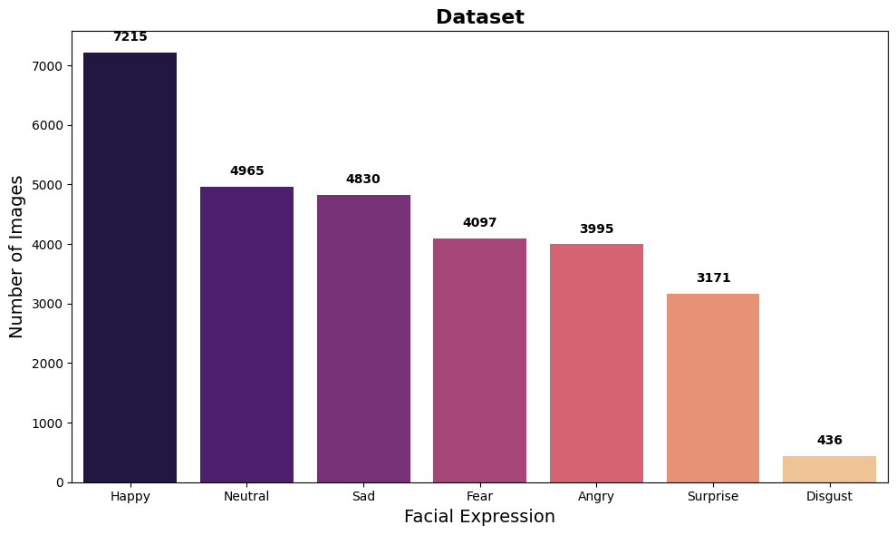
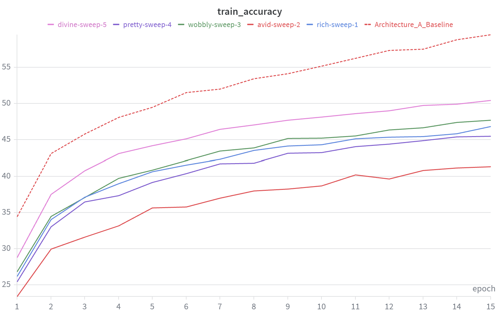
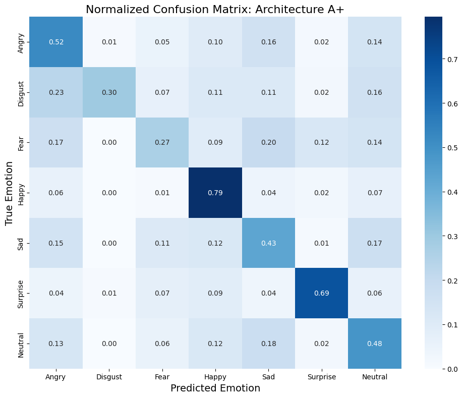
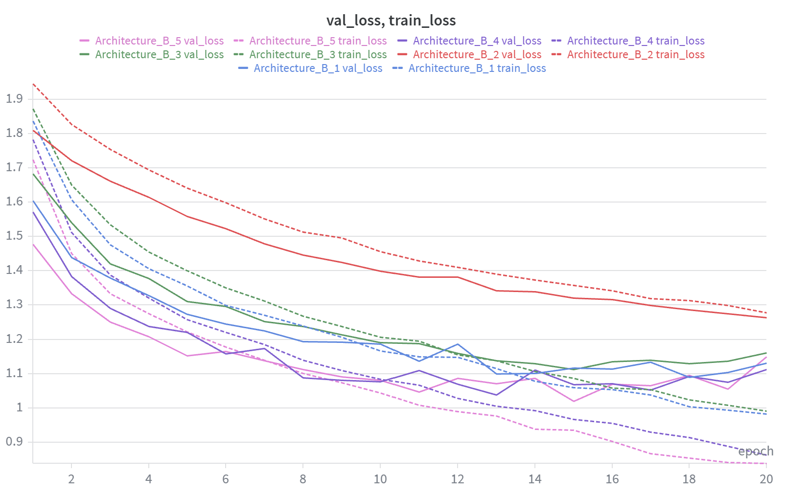
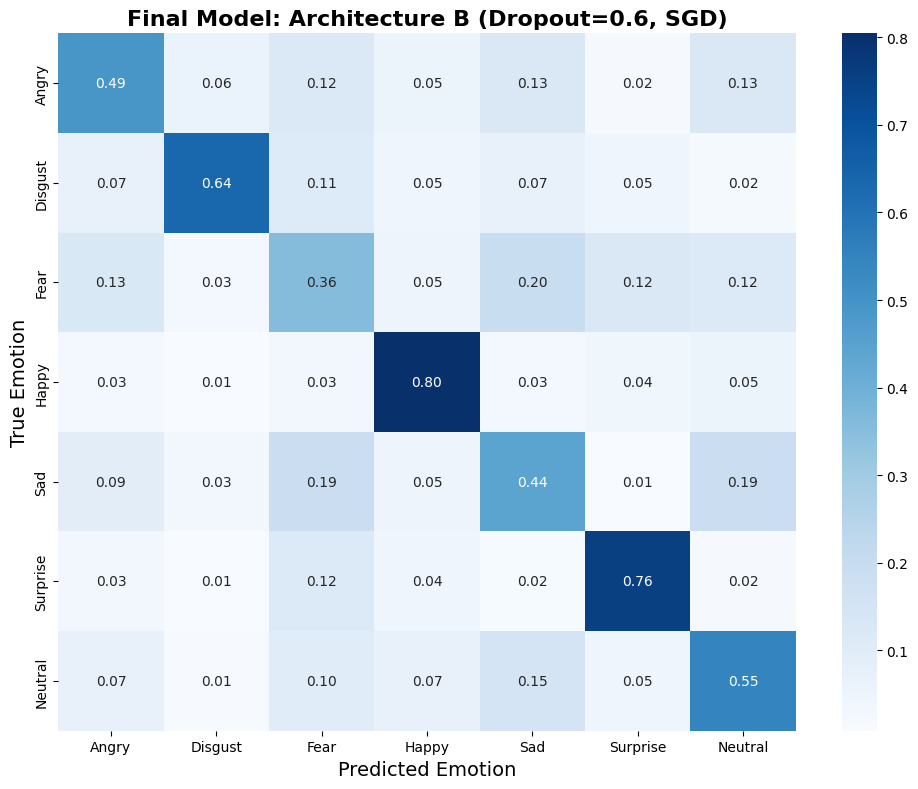
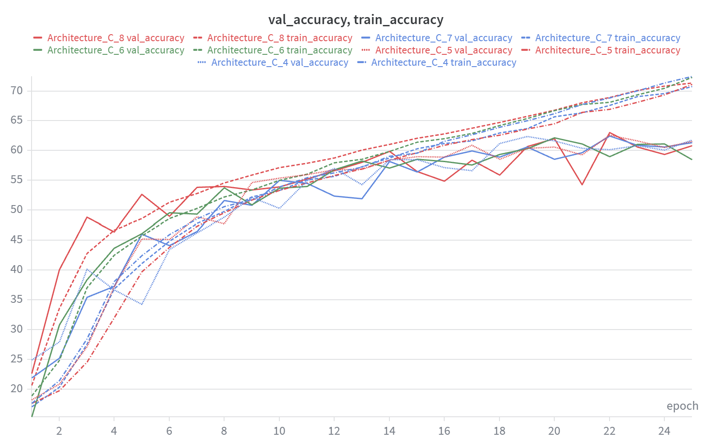
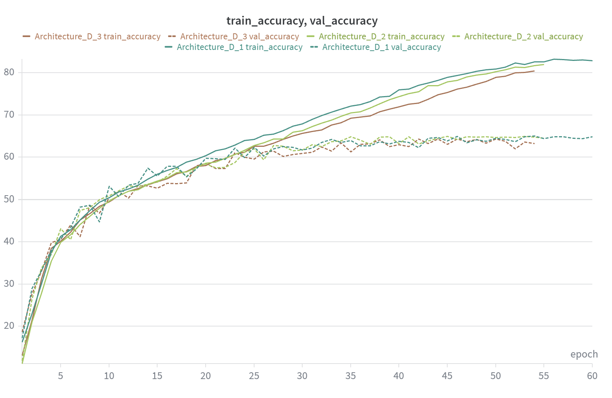
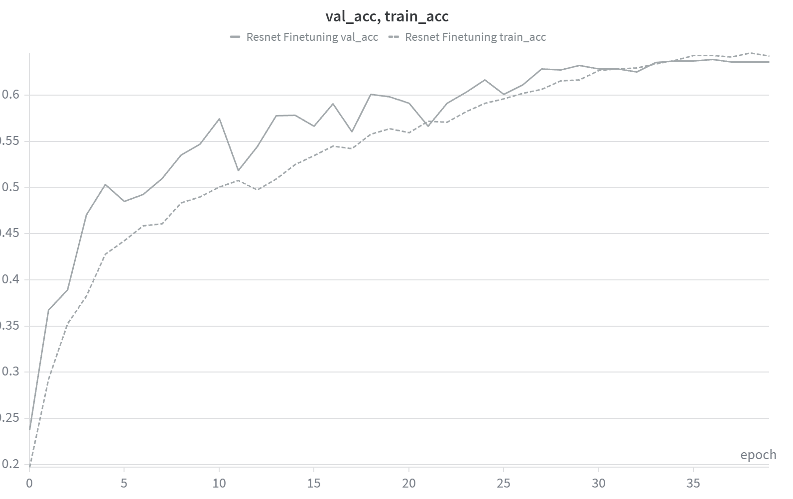

## ML Facial Expression Recognition

WanDB ბმული: https://wandb.ai/ndurishvili/facial-expression-recognition/overview

WanDB რეპორტი: https://wandb.ai/ndurishvili/facial-expression-recognition/reports/ML-Facial-Expression-Recognition--VmlldzoxNzI0MTg3OQ
(თითქმის ყველაფერი იგივე მიწერია რაც README-ში)

# დატასეტის ანალიზი

თავიდან შევხედე დატასეტს და განაწილება სხვადასხვა კლასების გამოიყურებოდა ასე 

როგორც ვხედავთ, happy სახეები ბევრია დატასეტში და disgust არის ძალიან ცოტა. 
ამან შეიძლება გამოიწვიოს ის, რომ მთელ ეპოქაში საერთოდ ერთი სემპლიც არ შევიდეს ამ ბოლო კლასიდან მაგალითად.
ამის მოსაგვარებლად შემოვიტანე კლასის weight-ები (baseline მოდელის შემდეგ გამოვიყენე ეს მიდგომა, პირველ მოდელს არ აქვს). 
loss ფუნქცია გაცილებით გაიზრდება, თუ მოდელი არასწორად გამოიცნობს disgust კლასს, ვიდრე happy-ის მაგალითად.
ამ გზით თვითონ loss ფუნქცია დააბალანსებს დაუბალანსებელ დატასეტს ერთგვარად.

## Architecture A

თავიდან დავატრენინგე საკმაოდ მარტივი არქიტექტურა: 

Conv2D (32) -> MaxPool2D -> Conv2D (64) -> Linear (128) 
ამ ეტაპზე არ გამომიყენებია dropout, batchnorm ან რამე სხვა. 
ყველა ახალი არქიტექტურის მოდელის გაშვებამდე 1 batch-ის ოვერფიტზე ვტესტავდი არქიტექტურას, რომ გამეტესტა forward და backward იმპლემენტაციები, 
რამდენად შეეძლო პატარა დატასეტის overfitting. აქტივაციის ფუნქციად ყველგან ReLU მაქვს გამოყენებული.

გრაფიკზე ჩანს, რომ მერვე ეპოქის შემდეგ დაახლოებით, ვალიდაციის ლოსი აღარ მცირდება, ტრენინგის ლოსი კი აგრძელებს კლებას.
ასევე ვხედავთ, რომ ტრენინგის accuracy მხოლოდ 60%-მდე ადის, რაც მეტი უნდა იყოს 15 ეპოქის შემდეგ.
აქედან გამომდინარე, ეს მოდელი არის overfit-შიც და bias-იც მაღალი აქვს.
იმის ფონზე რომ ეს საკმაოდ მარტივი არქიტექტურაა, გასაკვირი არაფერი არაა. 
ამის შემდეგ ვცადე ჰიპერპარამეტრების ოპტიმიზაცია და dropout-ის და batchnorm-ის დამატება მოდელში, ასევე weighted loss ფუნქციაც, რაზეც ზემოთ ვისაუბრე.
ჰიპერპარამეტრები, რასაც ვაოპტიმიზირებ ამ ეტაპზე, არის learning rate და dropout rate, ასევე optimizer-ად ვცდი sgd-საც Adam-ის გარდა.
ახალი არქიტექტურა არის: 
Conv2D (32) -> BatchNorm2D -> MaxPool2D -> 
Conv2D (64) -> BatchNorm2D ->
Linear (128) -> BatchNorm1D -> Dropout (p=0.5) -> Linear 

ახალ მოდელებს (sweep-ით გაშვებულს) ნაკლები accuracy აქვთ, ვიდრე წინას, მაგრამ ეს არის რეგულარიზაციის გამო, რეალურად overfitting-ის პრობლემა 
მოვაგვარეთ ამის სანაცვლოდ.

ამ მოდელის confusion matrix-ზე ჩანს, რომ ამ მოდელს არ აქვს საკმარისი პარამეტრი და უჭირს მსგავსი ემოციების განსხვავება. ანუ იმ ემოციებს, რომლებსაც მაგალითად
დაახლოებით ერთნაირი კუნთების მოძრაობა სჭირდება, ვერ ანსხვავებს. Disguist ჰგონია Angry ხშირად მაგალითად. 

## Architecture B

ახლა კიდევ უფრო გავართულოთ არქიტექტურა და დავუმატოთ ახალი ლეიერები:

Conv2D (32) -> BatchNorm2D -> Conv2D (32) -> BatchNorm2D -> MaxPool2D -> 
Conv2D (64) -> BatchNorm2D -> Conv2D (64) -> BatchNorm2D -> MaxPool2D -> 
Conv2D (128) -> BatchNorm2D -> Conv2D (128) -> BatchNorm2D ->  MaxPool2D ->
Linear (256) -> BatchNorm1D -> Dropout (p=0.5) -> Linear

ბევრი კონვოლუციური ლეიერი დავამატე და რაც მთავარია, Pooling layer-მდე ორი ლეიერი გვაქვს და არა ერთი. ეს მოდელს მეტ ხედვის არეს აძლევს, მეტ რამის
დანახვის საშუალებას აძლევს, ვიდრე ერთი უფრო დიდი ფილტრი რომ ამეღო ამის მაგივრად. ანუ ფოტოს შემცირებამდე pooling layer-ით მოდელს მეტი რაღაცის
სწავლის საშუალება უნდა ჰქონდეს, რადგან ორი ლეიერია და ორი ReLU, ანუ არაწრფივ კავშირებსაც უკეთესად ისწავლის ასე.

ჰიპერპარამეტრების ოპტიმიზაციამ მომცა ეს 5 მოდელი. ამ ხუთიდან, ლურჯი არის საუკეთესო, რადგან ყველაზე ნაკლებად გადის ოვერფიტში. დანარჩენი ყველა მოდელი ან 
overfitted არის ან underfitted. ყველაზე კარგი ლურჯია. ამ საუკეთესო მოდელმა მომცა 59.35% validation_accuracy, რაც წინა არქიტექტურაზე უკეთესია.
confusion matrix-ს თუ შევხედავთ, დავრწმუნდებით, რომ გაცილებით კარგი მოდელია ეს. disgust-ს და fear-ს ბევრად კარგად არჩევს.

## Architecture C

ახლა კიდევ უფრო გავართულოთ მოდელი და გამოვიყენოთ ResNet არქიტექტურა.
მთავარი სიახლე აქ არის, რომ CNN-ებთან ერთად დავამატეთ Skip Connection-ები gradient flow-ს გასაუმჯობესებლად.
ასევე, pooling-ის რამდენჯერმე გაკეთების და flatten-ის ნაცვლად, ბოლოში ვაკეთებთ average pooling-ს,
რამაც წესით ოვერფიტის პრობლემა უნდა მოაგვაროს. ანუ უბრალოდ ყველა ჩენელისთვის პიქსელების საშუალო მნიშვნელობას ვიღებთ ბოლოს და ერთ ცალ წრფივ ლეიერში ვატარებთ.

სამწუხაროდ resnet-მა დიდად ვერ გააუმჯობესა შედეგი. train-ის accuracy 70%-მდე ადის, მაგრამ ვალიდაცია 60%-ზე მეტი ვერ გახდა ამ არქიტექტურით. 
ანუ ისევ overfit-ის პრობლემა გვაქვს.

## Architecture D

ეს არის ყველაზე კომპლექსური არქიტექტურა, რასაც ვიყენებ ამ დავალებაში:

Conv2D (64) -> BatchNorm2D -> Conv2D (64) -> BatchNorm2D -> MaxPool2D -> 
Conv2D (128) -> BatchNorm2D -> Conv2D (128) -> BatchNorm2D -> MaxPool2D -> 
Conv2D (256) -> BatchNorm2D -> Conv2D (256) -> BatchNorm2D -> MaxPool2D -> 
Linear (192) -> Dropout (p=0.1) -> 
4x [LayerNorm -> MultiHeadAttention (heads=4) -> DropPath -> LayerNorm -> Linear (768) -> Dropout (p=0.1) -> Linear (192) -> Dropout (p=0.1) -> DropPath] -> 
LayerNorm -> MeanPool -> Linear (128) -> Dropout (p=0.1) -> Linear (7)

თავიდან კონვოლუციური ლეიერები სწავლობენ feature-ებს სურათებიდან, შემდეგ ამის output შედის attention layer-ებში, რომ ზუსტად ყურადღება რას მიაქციოს
მოდელმა ეგ ისწავლოს. საბოლოოდ კი ისევ წრფივი ლეიერებით გამოგვყავს ალბათობები.

ამ მოდელს უკეთესი შედეგი ჰქონდა, დაახლოებით 65% accuracy მივიღე ვალიდაციაზე. 

თუმცა როგორც ვხედავთ, ოვერფიტის პრობლემა აქაც არის, ტრენინგი 80%-ზე ადის, ვალიდაცია კი ჩერდება, 65%-ზე მეტი ვეღარ ხდება. ეს უკვე დატასეტის პრობლემაა,
ამ შემთხვევაში საუკეთესო მოდელი იქნება დაახლოებით 35-40 ეპოქაზე რომ გავჩერდეთ, ოვერფიტი ნაკლებად გვექნება.

ზოგადად რაც ვნახე ამ დატასეტზე, ადამიანებსაც კი 60% accuracy აქვთ და მოდელებიც 70%-ზე მეტს ვერ იღებენ. data augmentation კი გავაკეთე, მაგრამ
მაინც ამაზე დიდ შედეგს ვეღარ ვდებ მოდელებით.

## ResNet18 Finetuning

Finetuning-ის ცდა მინდოდა მთელი ამ კურსის განმავლობაში, ამიტომ ამ დავალებაში გადავწყვიტე ესეც გამეტესტა.
ResNet18 ავიღე, რომელიც ბევრ სურათზეა უკვე დატრენინგებული და ამ დატასეტით Finetuning გავუკეთე.
ბოლო FC Layer ავიღე და ჩავანაცვლე ჩემი ლეიერით, 7 ემოციის კლასიფიკაციისთვის 7 ნეირონიანი ლეიერით და გავუშვი ტრენინგზე.
დატასეტი რადგანაც შავ-თეთრია, მომიწია სურათების ხელოვნურად გაფერადება RGB რომ მიმეღო, რადგან ResNet18 ფერად სურათებზეა დატრენინგებული.

40 ეპოქის შემდეგ, ეს მოდელიც დაახლოებით 65% accuracy-ზე ავიდა, იმ განსხვავებით, რომ ოვერფიტი აქ არ გვაქვს და ტრენინგიც დაახლოებით მაგდენზეა.